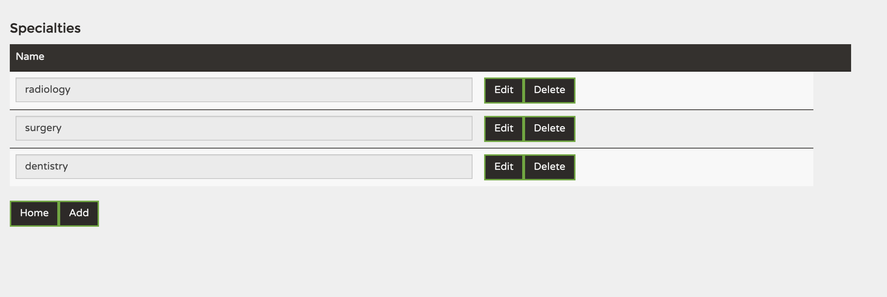
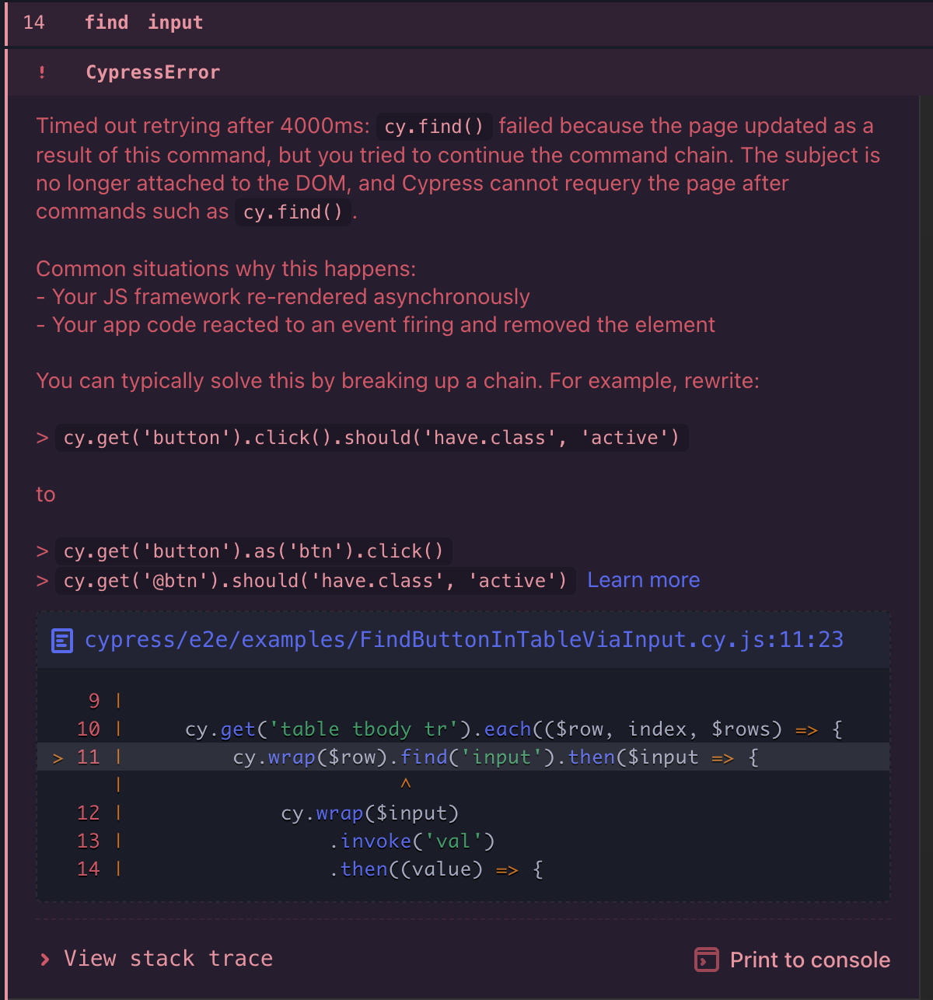

# Finding and clicking a button in a Table by checking the value of an input

The Problem:

We got a table with two columns and several rows. In column one, there is an input field for each row. In column two, there are two buttons per row. The buttons got the same name in all rows and no identification character in the HTML definition file besides its title (Edit or Delete).




We want to click on the edit field of a specific row identified by the content of the input field.

Say we want to edit the row with the value radiology.

We can try to find the table, iterate through the rows, check the value of the input of each row and when the value is radiology, we find the button and click it.

```
  let name = "radiology";

    cy.visit('http://localhost:4200/petclinic/specialties');

    cy.get('table tbody tr').each(($row, index, $rows) => {
        cy.wrap($row).find('input').then($input => {
            cy.wrap($input)
                .invoke('val')
                .then((value) => {
                    if (value === name) {
                        cy.log(" ### Edit - " + value);
                        cy.wrap($row).find('td').eq(1).contains('Edit').click();
                    } else {
                        cy.log(" ## Wrong Item - " + value);
                    }
                });
        });
    })
```

This won't work. The result is an error during the test run.



The reason for this is that clicking the edit button will open another webpage, but the each-loop still iterates through the table that suddenly is not available anymore.

Trying to jump out of the test via return won't help either. Still, the each-loop is running and testing.

To solve this problem, you need to use the alias feature of Cypress. When finding the correct button, you define an alias for this button and at the end outside of the ‘each’ loop, you get this alias element and click it.

````
     let name = "radiology";

        cy.visit('http://localhost:4200/petclinic/specialties');

        cy.get('table tbody tr').each(($row, index, $rows) => {

            cy.wrap($row).as('currentRow');

            cy.get('@currentRow').find('input').invoke('val').then((inputValue) => {
                if (inputValue == name) {
                
                    cy.wrap($row).contains('Edit') .should('exist').as('editButton');

                  }
                });
              });

              cy.get('@editButton').click();
````
Gone are the find problems.